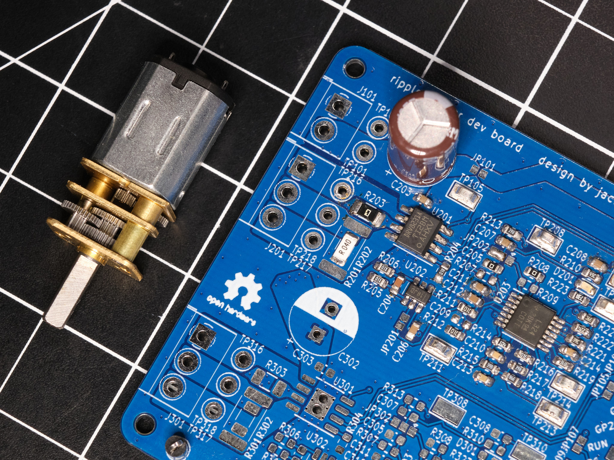

# ripplecounter

## What?

* Control the position and speed of a brushed DC motor, *any* brushed DC motor
* No sensors, electromechanical components, or extra wiring needed
* Measure motor current with no extra complexity or cost
* Lower resolution than an encoder, but good enough for many applications
* Use almost any microcontroller, not just a Raspberry Pi Pico

### How Does It Work?

DC motors work internally by using a commutator and brushes, essentially a rotary switch that applies power to each of the motor’s coils in sequence as it rotates. By sensing, amplifying, and filtering the current flowing through the motor, the current ripples that occur as the motor rotates and each coil is energized can be counted by a microcontroller.

### How Well Does It Work?

If component values for the signal conditioning circuit are selected properly, *very* well.

## Circuit Design

[Schematic as PDF](pcb/schematic%20rev1%2020230427-01.pdf)

The signal conditioning circuit is based on the design described in [Texas Instruments application note TIDA-01421](https://www.ti.com/lit/ug/tidud30a/tidud30a.pdf?ts=1682413672035) and [Microchip application note AN3049](http://ww1.microchip.com/downloads/en/Appnotes/Sensorless-Position-Control-of-Brushed-DC-Motor-Using-Ripple-Counting-Technique-00003049A.pdf). The initial current sense amplifier is implemented using the Texas Instruments INA181 IC (U202) with a current sense resistor directly in series with the motor, allowing for bidirectional current sensing. The remaining amplifier and filtering stages are implemented using an LM324 (U203) general-purpose quad op amp IC. U203B is used as an active bandpass filter, which works with two other RC low-pass filters to eliminate high frequency noise and low-frequency oscillations in current caused by varying load on the motor. U203C is used to subtract large and relatively slow changes in the signal, such as the motor's inrush current spike. U203D is used as a comparator with hysteresis to generate a clean output signal.

Purple: filtered, amplified motor current waveform (TP211); Yellow: output signal (TP215)

### Design Modification Guide

The component values used in this circuit will need to be adjusted for optimal performance with any motor - as-is, the values in the schematic were chosen for N20-size gearmotors and will work decently well for similar small motors.

When modifying the design for a different motor:

* The current sense resistor (R201/R202) value and power rating **must** be selected to keep the power dissipation in the resistor well within its specified power rating. For larger motors with high inrush/stall current, the pulse load capability of the resistor should also be considered.
* The current sense resistor value and the gain of the current sense amplifier (the INA181 IC used comes in four different fixed-gain options) **must** be selected to prevent clipping at the  output of the current sense amplifier with maximum motor current: `I_motor_max * R_isense * Gain < (3.3V / 2)`.

Several other components should be considered after choosing the sense resistor and amplifier:

* The gain of the active bandpass filter, set by R213 and R214, should be selected experimentally to minimize clipping at the output of the filter (TP211).
* The gain of the differential amplifier, set by R216-R219, should be selected experimentally to provide a clean output from the comparator (TP215). C214 should be changed if R217/R218 are changed by more than an order of magnitude.
* The cutoff frequencies of the active bandpass filter and the RC low-pass filter formed by R215 and C213 may need to be changed depending on the speed of the motor used. It is recommended that the cutoff frequency of R215/C213 be at least the motor's ripple frequency at full speed and the cutoff frequency of R214/C210 be at least two times that frequency.

## Development Board

The ripplecounter development board incorporates a Raspberry Pi Pico microcontroller, two motor drivers, and two copies of the signal conditioning circuit. The board is designed to allow the use of Texas Instruments DRV8231, DRV8231A, DRV8251, or DRV8251A SO-8 package H-bridge motor driver ICs, for up to 50V motor supply voltage and 4.1A peak output current. An external motor driver may also be used. The development board is designed to be manufactured by any low-cost PCB supplier, such as JLCPCB or PCBWay, and easily assembled and modified by hand - the smallest passive components used are 0603 size.

The top PCB is minimally assembled for manually testing the signal conditioning circuit; the bottom PCB has been modified to control a camera slider for focus stacking macrophotography.

### License
The schematic is in the public domain - you are free to use this circuit design for any purpose, without attribution. The PCB layout and Gerber files for the development board  are released under the CERN Open Hardware Licence Version 2 - Weakly Reciprocal (CERN-OHL-W V2).

## Firmware

Basic firmware using the Raspberry Pi Pico C SDK is provided, which moves the motor while printing the position, speed, and current draw via UART. All important constants are documented in `ripplecounter_motor.c`.

Note: When used with the DRV8\*21 motor controller on the development board, this firmware brakes the motor (as opposed to letting it coast) when it is not running, which is desirable for applications that require position control. If the motor is forcibly rotated while it is not running, the change in position will be detected via the ripple counter circuit, but sensing the *direction* of rotation is not implemented. If this functionality is needed, it can be implemented by sampling the motor current value read through the ADC, which will be negative or positive depending on which direction the motor is being turned.

### License

All code provided is released under the MIT License.
