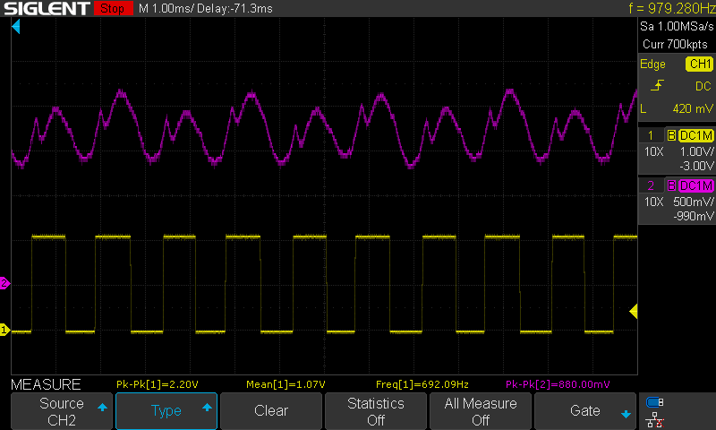

# ripplecounter
Sensorless brushed DC motor position control with Raspberry Pi Pico

## What?

* Control the position and speed of a brushed DC motor
* *Any* brushed DC motor.
* No sensors, electromechanical components, or extra wiring needed
* Measure motor current with no extra complexity or cost
* Lower resolution than an encoder, but good enough for many applications
* Use almost any microcontroller, not just a Raspberry Pi Pico

## Circuit Design

[Schematic as PDF](images/schematic%20rev1%2020230307-01.pdf)

The signal conditioning circuit is based on the design described in [Texas Instruments application note TIDA-01421](https://www.ti.com/lit/ug/tidud30a/tidud30a.pdf?ts=1682413672035) and [Microchip application note AN3049](http://ww1.microchip.com/downloads/en/Appnotes/Sensorless-Position-Control-of-Brushed-DC-Motor-Using-Ripple-Counting-Technique-00003049A.pdf). The initial current sense amplifier is implemented using the Texas Instruments INA181A1 IC (U202) with a current sense resistor directly in series with the motor, allowing for bidirectional current sensing. The remaining amplifier and filtering stages are implemented using an LM324 (U203) general-purpose quad op amp IC. U203B is used as an active bandpass filter, which works with two other RC low-pass filters to eliminate high frequency noise and low-frequency oscillations in current caused by varying load on the motor. U203C is used to subtract large and relatively slow changes in the signal, such as the motor's inrush current spike. U203D is used as a comparator with hysteresis to generate a clean output signal.

Purple: filtered, amplified motor current waveform (TP211)
Yellow: output signal (TP215)

## Development Board

The ripplecounter development board incorporates a Raspberry Pi Pico microcontroller, two motor drivers, and two copies of the signal conditioning circuit. The board is designed to allow the use of Texas Instruments DRV8231, DRV8231A, DRV8251, or DRV8251A SO-8 package H-bridge motor driver ICs, for up to 50V motor supply voltage and 4.1A peak output current.

### License
The schematic is in the public domain - you are free to use this circuit design for any purpose, without attribution. The PCB layout and Gerber files for the development board  are released under the CERN Open Hardware Licence Version 2 - Weakly Reciprocal (CERN-OHL-W V2).

## Firmware

Basic firmware using the Raspberry Pi Pico C SDK is provided, which moves the motor while printing the position, speed, and current draw via UART. All important constants are documented in `ripplecounter_motor.c`.

### License

All code provided is released under the MIT License.
